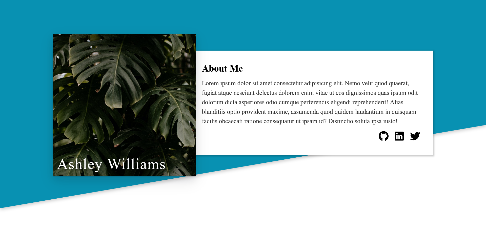

# The Last Project in Odin's Advanced HTML and CSS (Homepage)

I just did the header part because I think it's the trickiest one.

Here's the [Project's Link](https://www.theodinproject.com/lessons/node-path-advanced-html-and-css-homepage) on the Odin Project's website.

## Design Files

- [Mobile](https://cdn.statically.io/gh/TheOdinProject/curriculum/1c8b5c739efd263e8cc48703988b18d6e3afe034/advanced_html_css/responsive-design/project_personal_portfolio/imgs/portfolio%20mobile.png)
- [Tablet](https://cdn.statically.io/gh/TheOdinProject/curriculum/1c8b5c739efd263e8cc48703988b18d6e3afe034/advanced_html_css/responsive-design/project_personal_portfolio/imgs/portfolio%20tablet.png)
- [Desktop](https://cdn.statically.io/gh/TheOdinProject/curriculum/1c8b5c739efd263e8cc48703988b18d6e3afe034/advanced_html_css/responsive-design/project_personal_portfolio/imgs/portfolio.png)

## Screenshot

## Live Preview

[Github Pages](https://x287xtesting.github.io/odin-project-advanced-html-and-css-last-project/)

## Notes

I was just focusing on the layout and getting it to looks as close to the design as possible so no focus on accessibility and performance, also I didn't change the default fonts.

I used [Font Awesome](https://fontawesome.com/) for the icons, and sometimes they're being loaded after the page has fully rendered which is causing some rendering issues.
